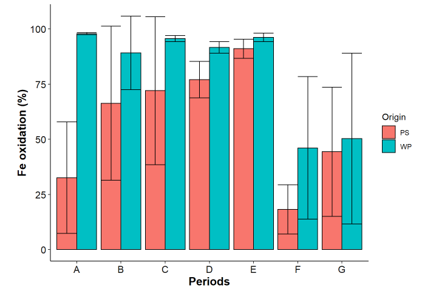
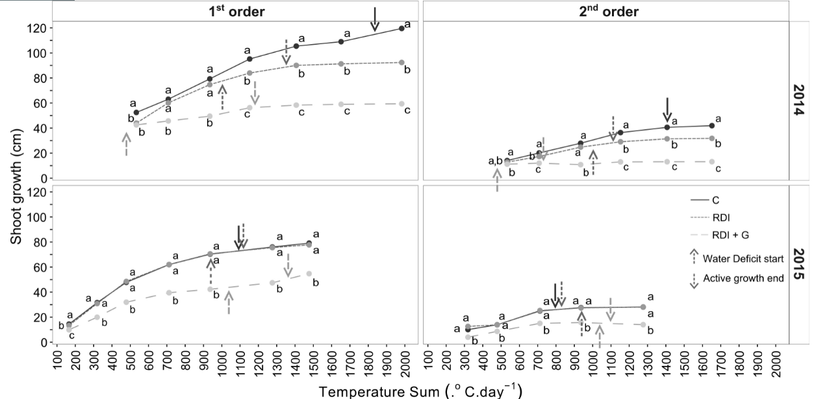

# Mon offre

::: {align="justify"}
Je propose mes services en tant qu'analyste de données pour des projets
de recherche en sciences de la vie, **avec un tropisme pour les projets
en agroécologie, agronomie et écologie**, étant titulaire d'un master en
écologie et d'un doctorat en agronomie, et souhaitant mettre mes
compétences au service de la transition agroécologique.\
\
Je peux travailler sur les données de votre structure tout comme
intégrer comme partenaire un projet de recherche annuel ou pluri-annuel
(CASDAR, ANR, projet européen, etc.) et prendre en charge le volet
analyse de données, c'est à dire :

-   la préparation des données (nettoyage, fusion de tableaux,
    structuration du tableau, etc.), et ce en lien avec les
    notateur-rice-s pour optimiser les feuilles de notation et faciliter
    la saisie et l'analyse

-   la production des résultats publiables (tableaux de synthèse,
    graphiques)

-   l'analyse statistique pour des modèles classiques (régressions
    linéaires, anovas, ACP)

-   la production de rapports de synthèse

Je propose également de développer des applications interactives
(package shiny) qui peuvent être utilisées par les partenaires pour
explorer les données à la souris (sans codage) ou pour créer des
tableaux de bords de synthèse des résultats, et ce dès la saisie des
premières données, afin de pouvoir s'adapter à d'éventuels aléas
nécessitant la modification du protocole de suivi et de récolte des
données.

J'utilise le logiciel RStudio, le package Tidyverse et le format
Rmarkdown et propose pendant la durée du projet de former les
partenaires intéressé-e-s à leur utilisation.
:::

# Exemples de réalisations

## Productions de rapports de synthèse

-   Format html ou pdf

{width="300" height="400"}{width="300" height="400"}

```{r eval=FALSE, include=FALSE, out.width="100%"}

knitr::include_graphics('img/rapport_markdown_brutes.png')

```

## Explorations des données brutes

-   Comptage d'individus

```{r eval=FALSE, fig.align="center", fig.show="hold", include=FALSE, out.height="20%", out.width="25%"}

knitr::include_graphics(c("img/comptage.png","img/comptage_individus.png"))

```

{width="300"
height="200px"}{width="300"
height="200px"}

-   Visualisation de facteurs croisés (concentrations de métaux, dose
    d'engrais, compartiment (racines et feuilles), inoculation en
    mycorhizes)

```{r echo=FALSE}

knitr::include_graphics('img/brutes_facteurs_croises.png')

```

-   Relations par paires de variables

{width="300"
height="200px"}{width="300" height="200px"}

## Préparation des données

-   Restructuration (une colonne = une variable; une ligne = une
    observation) d'un tableau sorti d'une machine + création des
    colonnes d'identifiants individus + fusion de tableaux


-   Restructuration (une colonne = une variable; une ligne = une
    observation) du tableau de données brutes + création des colonnes
    d'identifiants individus + fusion de tableaux


## Graphiques et tableaux de synthèse

-   Ratios entre variables

{width="300" height="200px"}

-   Moyennes et écart-types

{width="300"
height="200px"}{width="300" height="200px"}

-   Tableaux de contingence

{width="300" height="200px"}

## Statistiques

-   Régressions linéaires

{width="500" height="300px"}

-   Tableau d'anova

{width="300" height="200px"}

## Applications shiny

-   Application d'autoévaluation à ma formation par les participant-e-s

{width="300" height="200px"}

# Conditions de travail

## Modalités

Je privilégie le travail en distanciel, pour des raisons familiales (ma
femme a la santé fragile) et écologiques, mon activité étant tout a fait
compatible avec cette modalité.

## Tarifs

Je propose mes prestations au tarif de 30€ de l'heure, soit 210€ la
journée.

## Qui suis-je?

::: {align="justify"}
Je m'appelle Oswaldo Forey, passionné par la recherche en agroécologie
et les méthodes permettant de faire parler les données et de les
communiquer. Je me suis spécialisé dans l'utilisation de RStudio, du
Tidyverse et de Rmarkdown et suis formateur à ces outils depuis 2018
([\<https://oswaldoforey.github.io/Website_bookdown/\>](https://oswaldoforey.github.io/Website_bookdown/){.uri}).

A mes heures perdues, je conduis des recherche en philosophie des
sciences appliquée à l'agroécologie, sur les questions de l'utilisation
des "lois" de l'écologie et des styles de raisonnement scientifiques
(Crombie, 1981) pour la création d'une méthode générique de conception
d'agroécosystèmes (<https://doi.org/10.1007/s40656-020-00336-9>).

## Expériences professionnelles

-   **Analyste de données - INRAE GAFL Avignon - CDD 3 mois (2019)**

Production de 7 rapports à partir de 27 jeux de données

-   **Formateur à RStudio/Tidyverse/Rmarkdown - Micro-entrepreneur -
    2018 à aujourd'hui**

Production de 26 rapports d'accompagnement de participant-e-s
post-formation

## Formations

-   Doctorat en agronomie - UMR ABSys (INRAE Montpellier) - 2016

-   Master 2 en écologie - Université de Monptellier - 2013
:::

<br>

 <br>

## Contacts

M Oswaldo FOREY\
1300 route de Collonge\
26260 Saint-Donat-Sur-l'Herbasse

[oswaldoforey\@gmail.com](mailto:oswaldoforey@gmail.com){.email}\
tel : 04 27 63 96 07

Site internet analyste de données:\
Site internet formateur :
<https://oswaldoforey.github.io/Website_bookdown/>
